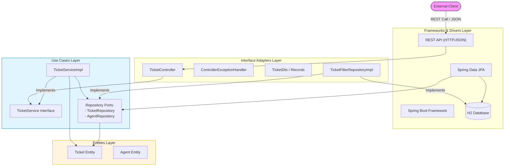

# Demo Project

> Reference: Pluralsight course: [TDD using Spring 6 and JUnit](https://app.pluralsight.com/ilx/video-courses/tdd-spring-6-junit/course-overview)

Junie AI Help: Based on the analysis of the `ticket-api` project, here is a component diagram illustrating the architecture and interactions between the different layers of the application.

### Clean Architecture Diagram (Full Flow)

---

### Understanding the REST Call in Clean Architecture

In this model, the **REST Call** is handled as follows:

1.  **Entry Point**: The **External Client** (like a Browser or Postman) sends an HTTP request.
2.  **The Adapter**: The **Framework Layer** (Spring Web) receives the raw bytes and hands them to the **`TicketController`** (Interface Adapter). The Controller's job is to "adapt" the web world into the application world.
3.  **Inward Bound**: The Controller converts the incoming JSON into a **DTO** and calls the **`TicketService`** (Use Case).
4.  **The Boundary**: Notice that the Controller doesn't call the implementation (`TicketServiceImpl`) directly; it calls the **Interface** (`TicketService`). This is the boundary between the "How" (Web) and the "What" (Business Logic).
5.  **Data Transformation**: When the service is done, it returns data. The Controller then uses the **`TicketDto`** to format that data back into JSON for the client.

### Summary of Component Responsibilities
*   **External Client**: Initiates the request (The Driver).
*   **Frameworks (WebREST)**: Handles the technical details of HTTP/TCP.
*   **Adapters (Controller)**: Marshals data between the Web and Use Cases.
*   **Use Cases (ServiceImpl)**: Executes application-specific logic.
*   **Entities**: Holds the fundamental business rules.

This diagram now shows the complete lifecycle of a request while maintaining strict Clean Architecture boundaries.
